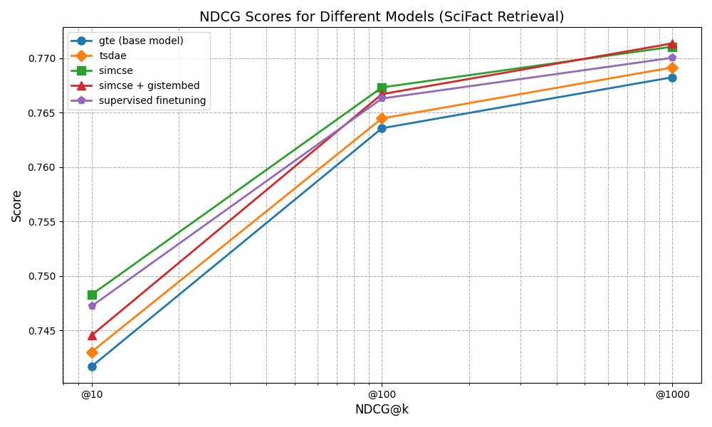

# Finetuning of embedding models 

Embedding models are crucial components in modern natural language processing, serving as the foundation for numerous applications, particularly in Retrieval-Augmented Generation (RAG) systems. These models transform text into dense vector representations, enabling efficient semantic search and comparison. However, despite great generalizability abilities of state-of-the-art embedding models, the models still can be improved when applied to specific tasks or domains. 

This respository provides short examples and explanations on fine-tuning methods for embedding models. The used dataset is [SciFact](https://huggingface.co/datasets/BeIR/scifact-generated-queries) consisting of scientific texts and according queries which are used for the retrieval task that is also part of the [MTEB benchmark](https://huggingface.co/spaces/mteb/leaderboard). The notebook `main.ipynb` contains explanations for the used methods, hyperparameters and training data.

## Results

 
<em>gte model finetuned with different methods and evaluated on SciFact retrieval task</em>

Embedding models are used off-the-shelf in their general version even when used for specific domains. However, even with this very simplistic finetuning on a small dataset (10k sentences) the retrieval performance already improves slightly. 

